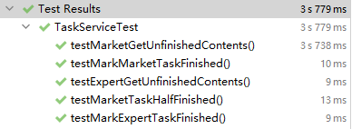
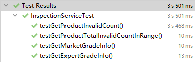
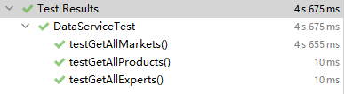

# OOAD Final Project Document

### 小组成员

- 17302010002 黄元敏
- 17302010009 陆逸凡

## 一、前言

本次项目通过一个集成了嵌入式数据库H2以及持久化框架Hibernate的Maven项目来实现一个农贸市场农产品快检系统。

本文档旨在简要陈述本项目的代码结构、静态模型设计、使用到的相关设计模式和测试用例描述及其结果。

## 二、代码结构

本项目代码结构如下：

### 1. 源代码

- dao：包内定义了项目中使用到的各个实体类；
- entity：包内定义了OR Mapping框架生成的实体类；
- service：包内定义了实现主要业务逻辑的各Service接口以及实现类；
- utils：包内定义了负责数据库访问的相关类；

### 2. resources

- mapper：包内定义了OR Mapping框架生成的XML Mapping；
- hibernate.cfg.xml：文件内定义了数据库相关的配置；

### 3. test

- service：包内包含了对主要业务逻辑的测试文件，具体测试内容将在后续测试用例描述部分涉及；

## 三、静态模型设计

本次项目的类图设计如下图所示。

TODO：图

TODO：具体描述

## 四、相关设计模式

### 1. 设计原则

#### 信息专家

本项目的实现遵循了信息专家的原则，尽可能保证每个业务类/实体类完成其自身信息所支持能完成的工作，并将结果给出到外部调用类。

大体上，`Service`类主要通过调用`Task`类的具体方法来实现具体业务。例如，在`TaskService.addCheckResult`中，即通过调用`CheckTask.addCheckResult`来实现标记某一个产品检查结果的功能。

#### 用例控制器

本项目的`Service`类遵循了Use Case Controller的原则，即某个特定用例的所有事件操作定义在同一个用例控制器中。

例如，`TaskService`主要负责查询未完成的检查任务、添加检查任务结果和标记检查任务完成三种功能，集中了与任务完成度相关的所有系统事件。

#### 依赖注入

在设计项目的过程中，我们发现标记完成检查任务和评价市场、专家检查工作及时性的过程中，我们都需要用到当前系统日期信息。同时，又考虑到测试时，我们不能直接使用真实系统时间，而需要对其进行Mock。因此，我们应当使用依赖注入的方式来处理系统时间与业务之间的关系。

具体地，我们通过在`InspectionService`和`TaskService`中注入`TimeService`实现的方式来实现系统时间对业务的依赖注入。当Service中需要评估任务完成及时性或添加检查任务结果时，将通过注入的`TimeService`获得系统当前时间。

而在测试时，我们通过构建Mock的`TimeService`实现类来模拟获取系统当前时间，不同于正常`TimeService`实现中直接通过new Date()的方式获取当前日期，在Mock的`TimeService`实现中，获取当前日期将始终返回一个内部记录的`currentDate`属性，而该属性可以通过特定方法进行手动调整。我们只需要在构造`InspectionService`和`TaskService`时注入Mock的`TimeService`实现，就能实现我们在测试时对系统时间的控制。

### 2. 设计模式

#### Visitor

在本项目中，我们识别到需求中的统计不合格产品数、统计市场得分情况和统计未完成检查任务均包含了对某个`AbstractInspectionTask`（专家抽检任务或市场自检任务）下的`CheckTask`（市场具体检查任务）列表的遍历。因此，我们在其中抽象出了Visitor模式，即通过`AbstractInspectionTask`接受一个`AbstractVisitor`对`CheckTask`列表的访问来完成具体业务。

在模式中，`AbstractInspectionTask`类对应`Element`类，`AbstractVisitor`类对应`Visitor`类；`SelfInspectionTask`和`ExpertInspectionTask`对应了`ConcreteElement`，service.visitor包中的实体类对应了`ConcreteVisitor`。

在这里，我们对传统Visitor模式稍稍进行了一些改动。由于传统访问者模式不能很好地支持返回值，更何况我们所用到的实际业务中所需的返回值类型各不相同。因此，我们在各个`ConcreteVisitor`中加入了适合各自业务的`result`字段，并添加了`getResult`方法用以获得该结果。Visitor在visit相应Element的过程中，会对该结果进行更新。

#### Decorator

对于给市场和专家评价的部分，我们识别到可以使用装饰器模式来进行评分信息的生成。主要理由在于：对于未按时完成任务的情况，存在评分叠加的情况，即单纯的未按时完成应当扣10分，而超时20天以上未完成还要再扣20分，这样的情况符合装饰器模式对单个对象在基础效果上不断叠加的特性，而和策略模式中对所有对象运用不同类型计算方式的用况不太相同。

在模式中，一个定义了`getGrade`方法的接口作为`Component`，`AbstractInspectionTask`和`CheckTask`作为`ConcreteComponent`，`AbstractDecorator`作为`Decorator`，dao.decorator包中的实体类对应了`ConcreteDecorator`。

在使用中，我们首先在外部对Task的完成情况和完成时间进行判断，而后以Task实例为参数对应创建符合条件的`ConcreteDecorator`，并调用其`getGrade`方法返回我们所需要的任务评价信息。

## 五、测试用例描述及结果

### 1. TaskServiceTest

该测试类主要用于测试查询未完成检查任务和完成检查任务功能的正确性。

在测试开始前，我们首先构建一个包含1号、2号、3号三个市场，1号、2号两种产品的自检任务，一个包含1号、2号两个市场，1号、3号两种产品，1号专家负责的抽检任务。

#### testMarketGetUnfinishedContents

对自检任务列举未完成任务，得到每个市场对应未完成检验的产品列表，应与测试开始前设定的产品列表相同。

#### testMarkMarketTaskFinished

完成自检任务中的每一个市场的每一个产品检验任务，而后对其列举未完成任务，应当获得一个空Map。

#### testExpertGetUnfinishedContents

对抽检任务列举未完成任务，得到每个市场对应未完成检验的产品列表，应与测试开始前设定的产品列表相同。

#### testMarkExpertTaskFinished

完成抽检任务中的每一个市场的每一个产品检验任务，而后对其列举未完成任务，应当获得一个空Map。

#### testMarketTaskHalfFinished

完成自检任务中：

- 1号市场的所有任务
- 2号市场的1号产品检查任务

而后对其列举未完成任务，应当获得一个拥有两个键值对的Map：

- 第一个键值对为2号市场 -> [2号产品]
- 第二个键值对为3号市场 -> [1号产品，2号产品]

### 2. InspectionServiceTest

该测试类主要用于测试统计产品不合格件数和评价专家、市场完成检查任务及时性功能的正确性。

在测试开始之前，我们首先构建以下检查任务供之后的测试使用：

- 市场自检任务1：包含1号、2号、3号市场，1号、2号产品，在**当前日期6天后截至**；
- 市场自检任务2：包含2号、3号市场，1号、2号、3号产品，在**当前日期10天后截至；**
- 专家抽检任务1：包含1号、2号、3号市场，1号、2号产品，由1号专家负责，在**当前日期6天后截至**；
- 专家抽检任务2：包含2号市场，1号产品，由1号专家负责，在**当前日期10天后截至；**
- 专家抽检任务3：包含2号市场、3号产品，由2号专家负责，在**当前日期15天后截止**；

而后分别设置其完成情况：

- 市场自检任务1：
  - 1号市场在当前日期12天后，上报1号产品有1项不合格；
  - 1号市场在当前日期2天后，上报2号产品有2项不合格；
  - 2号市场在当前日期5天后，上报1号产品有3项不合格；
- 市场自检任务2：
  - 2号市场在当前日期当天，上报1号产品有1项不合格；
  - 3号市场在当前日期14天后，上报1号产品有2项不合格；
  - 3号市场在当前日期4天后，上报2号产品有5项不合格；
  - 3号市场在当前日期8天后，上报3号产品有7项不合格；
- 专家抽检任务1：
  - 1号专家在当前日期2天后，标记1号市场的1号、2号产品分别有1项、2项不合格，并标记1号市场检查任务完成；
  - 1号专家在当前日期5天后，标记2号市场的1号产品有3项不合格；
- 专家抽检任务2：
  - 1号专家在当前日期5天后，标记2号市场的1号产品无不合格项，并标记2号市场检查任务完成，专家抽检任务整体完成；
- 专家抽检任务3：
  - 不设置；

#### testGetExpertGradeInfo

测试根据历史专家抽检任务评估专家任务完成及时度的功能，共包含三次测试（此处设计为专家需完成所有分配的市场抽查任务才算完成一次任务）：

- 仅考虑专家抽检任务1，在**当前日期30天后**进行评估，应当有一条评分记录：
  - 1号专家超时未完成，且超过截止日期20天以上，得-30分；
- 仅考虑专家抽检任务2，在**当前日期30天后**进行评估，应当有一条评分记录：
  - 1号专家按时完成，得10分；
- 综合考虑专家抽检任务1、专家抽检任务2、专家抽检任务3，在**当前日期30天后**进行评估，应当有两条评分记录：
  - 1号专家超时未完成1次，且超过截止日期20天以上1次，按时完成1次，得 - 10 - 20 + 10 = -20 分；
  - 2号专家超时未完成1次，得-10分；

#### testGetMarketGradeInfo

测试根据历史市场自检任务评估农贸市场任务完成及时度的功能，共包含四次测试：

- 仅考虑市场自检任务1，在**当前日期30天后**进行评估：
  - 首先使其继续完成任务：
    - 在当前日期12天后标记1号市场自检任务完成；
    - 在当前日期4天后标记2号市场自检任务完成；
    - 在当前日期30天后添加3号市场自检记录，但仍未完成自检任务；
  - 而后进行市场任务完成及时度评估，情况应当如下：
    - 1号市场超时完成，得-10分；
    - 2号市场按时完成，得10分；
    - 3号市场超时未完成，且超过截止日期20天以上，得-30分；
- 仅考虑市场自检任务2，在**当前日期8天后**进行评估：
  - 直接进行市场任务完成及时度评估，由于没有市场完成自检任务且均未超时，应当没有市场评分记录；
- 仅考虑市场自检任务2，在**当前日期12天后**进行评估：
  - 直接进行市场任务完成及时度评估，应当有两个市场评分记录，具体情况应当如下：
    - 2号市场超时未完成，得-10分；
    - 3号市场超时未完成，得-10分；
- 综合考虑市场自检任务1、市场自检任务2，在**当前日期16天后**进行评估：
  - 直接进行市场任务完成及时度评估，应当有三个市场评分记录，具体情况应当如下：
    - 1号市场超时完成1次，得-10分；
    - 2号市场按时完成1次，超时完成1次，得0分；
    - 3号市场超时未完成2次，得-20分；

#### testGetProductTotalInvalidCountInRange

测试统计某个农贸产品类别在某个时间范围内的总的不合格数（时间以抽检日期为准），共包含三次测试：

- 仅考虑市场自检任务1，在**当前日期后3天至14天**范围内，应当有一种产品不合格：
  - 1号产品不合格数为4；
- 仅考虑市场自检任务2，在**当前日期前1天至后9天**范围内，应当有三种产品不合格：
  - 1号产品不合格数为1；
  - 2号产品不合格数为5；
  - 3号产品不合格数为7；
- 综合考虑市场自检任务1、市场自检任务2，在**当前日期后1天至10天**范围内，应当有三种产品不合格：
  - 1号产品不合格数为3；
  - 2号产品不合格数为7；
  - 3号产品不合格数为7；

#### testGetProductInvalidCount

测试一次监管任务中，各类产品的不合格总数，即：

- 对于市场自检任务1，应当有两种产品不合格：
  - 1号产品不合格数为4；
  - 2号产品不合格数为2；
- 对于市场自检任务2，应当有三种产品不合格：
  - 1号产品不合格数为3；
  - 2号产品不合格数为5；
  - 3号产品不合格数为7；

### 3. DataServiceTest

该测试类主要用于测试数据库持久化相关操作的正确性。

#### testGetAllExperts

读出数据库中所有的`Expert`对象，返回一个`List`。

#### testGetAllMarkets

读出数据库中所有的`Market`对象，返回一个`List`。

#### testGetAllProducts

读出数据库中所有的`Product`对象，返回一个`List`。

